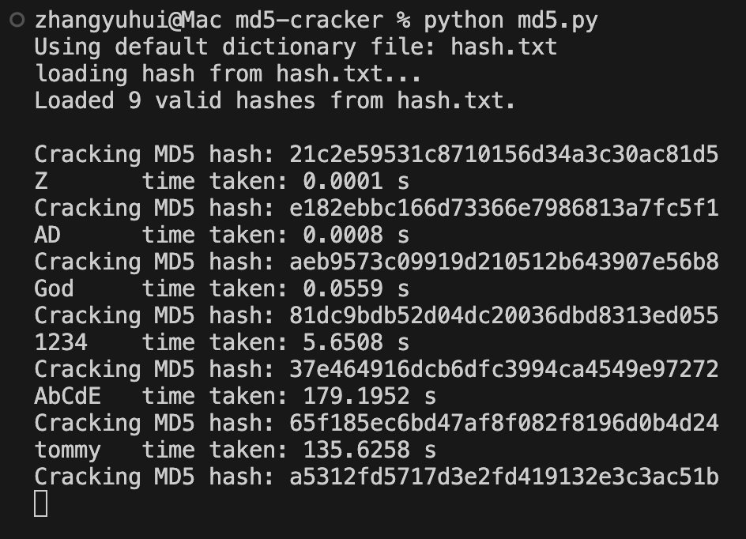

# ITP 125 Final Project 

## Part I: Pre-Project Questions

### What is a brute force password cracker? How does it work? 

A brute force password cracker such as **John the Ripper** and **Hashcat** is an automated tool that attempts every possible combination of characters to guess a password or encryption key [^1]. These tools leverage computational power (e.g., GPUs) to speed up the process of cracking passwords by parallelizing calculations. They are useful for exploiting weak passwords or encryption methods. Threat actors use them to gain unauthorized access to accounts, networks, or encrypted data[^1][^2].

### Why are we having you do this assignment? Can you do some research into real life applications where a threat actor would use a tool like this?

- Even though this attack is quite time consuming and can be protected just by using strong passwords, it is still a threat.
- This is because in 2025, simple password such as `123456`, `admin` and `password` are still used by many people, according to 2025 Specops Breached Password Report[^3].
- Thus, learning this attack and how to prevent it is important to learn, as it is also used commonly in real life.
- There are many real life applications where a threat actor would use a tool like this
- In August 2021, T-Mobile, one of the largest wireless network operators in the US, fell victim to a substantial cybersecurity breach traced back to a brute force attack. The incident led to the exposure of sensitive personal data of over 37 million past, present, and prospective customers. The stolen data included social security numbers, driver’s license information, and other personally identifiable data[^4].
- In 2015, hackers used brute force algorithms to breach Dunkin’ Donuts’ loyalty accounts, stealing rewards cash and costing the company $650,000 in fines[^5].  
- Not only does it can cause data breaches, it can also crack passwords such as Wi-Fi networks, encrypted databases, etc[^6].

### Part II - The Script

- The script can be found in `md5.py` which can be run by using `python md5.py <hash_fileame, default to hash.txt>` (no other modules are required), the dictionary and min and max length of the password can also be changed in the program.
- The helper scripts `md5_helper.py` is also provided, which can encrypt a list of strings from a specified file to md5 hashes to the file `hash.txt`.

### Part III - Testing

Due to time constraint, the single thread python script can only cracked the password with the length up to 5, shown in the screenshot below.

### Part IV - Analysis

#### Relationship between password length and time to crack

- The longer the password, the longer it takes to crack; also,the longer the password, the more combinations there are, thus, the longer it takes to crack.
- Specifically, the time to crack is exponential to the length of the password. Thus it would take hours to crack password with a length greater than 5.
  
#### Potential improvements for speeding up the computation

- Use faster programming language with compiler optimizations, such as C++ with flag `-O3`, as python is known to be slow.
- Use multithreading to speed up the computation: this allows the program to crack multiple passwords at the same time (e.g., a CPU with 8 threads can crack 8 passwords at the same time, which would theoretically be 8x faster).
- Use GPU to speed up the computation - GPUs has much more computing units than CPUs, and they are designed to do simple and repetitive tasks. For example, the latest NVIDIA GeForce RTX 5090 features 170 Streaming Multiprocessors (SMs), each SM comprises 128 CUDA cores, resulting in a total of 21,760 CUDA cores (similar but slightly different, like 21,760 threads in CPU) for the entire GPU[^7]. This allows the process to be even more faster and is also implemented in popular tools such as **John the Ripper**.
- Besides plain guessing, there are other "smarter" ways to crack the password depending on the senario case by case. For example, using **Dictionary Attack** which common words or phrases (like "baseball" or "qwerty") to try and crack a password. Attackers customize these word lists by adding numbers or special characters to match password complexity requirements, making the attack more effective[^6]. Or using rainbow table attacks when knowing the unsalted hashes of the passwords.

### Part V - Extras

- **Multithreading**: `md5_multithread.cpp` is an updated version that uses `threading` to speed up the program, this requires openssl libary to be installed. Use `make` to build the program and links the openssl libary for MacOS (via Homebrew) and Linux systems.

[^1]:https://www.infosecinstitute.com/resources/hacking/popular-tools-for-brute-force-attacks/
[^2]:https://usa.kaspersky.com/resource-center/definitions/brute-force-attackbrute-force-attack
[^3]:https://specopssoft.com/our-resources/most-common-passwords/
[^4]:https://specopssoft.com/blog/brute-force-attack/
[^5]:https://www.strongdm.com/blog/brute-force-attack
[^6]:https://www.darktrace.com/fr/cyber-ai-glossary/password-cracking
[^7]:https://boxx.com/blog/hardware/nvidia-geforce-rtx-5090-vs-rtx-4090